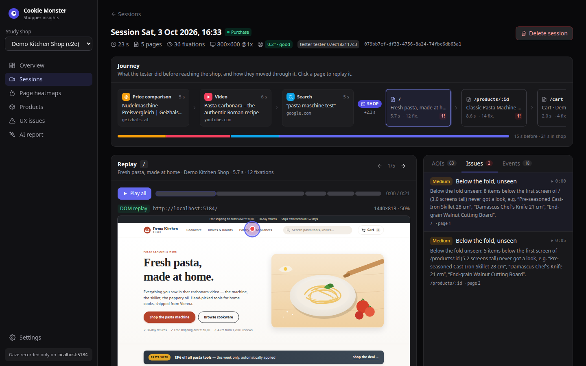
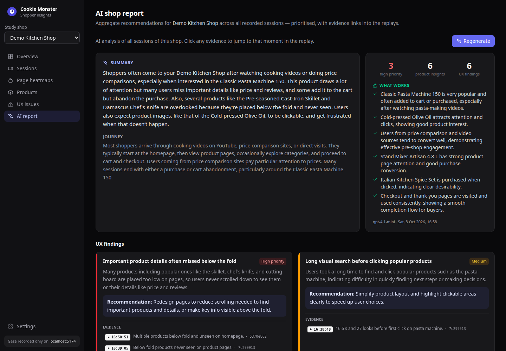
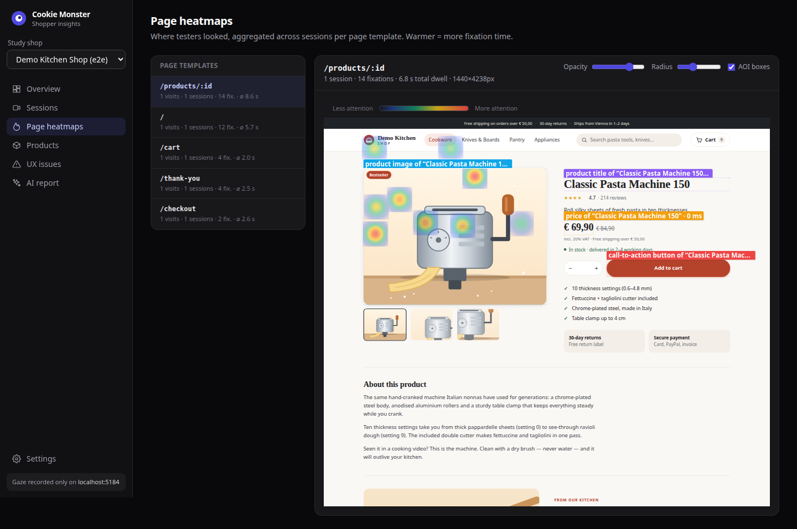
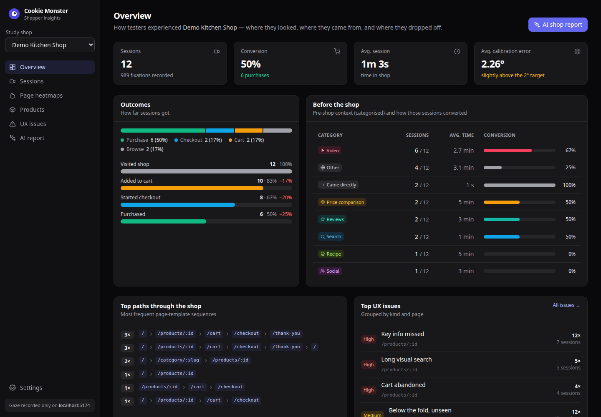
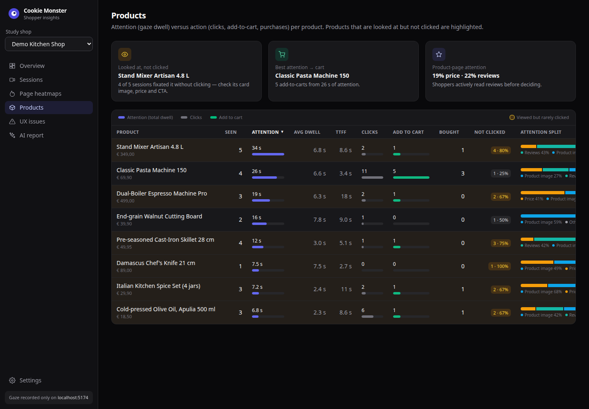
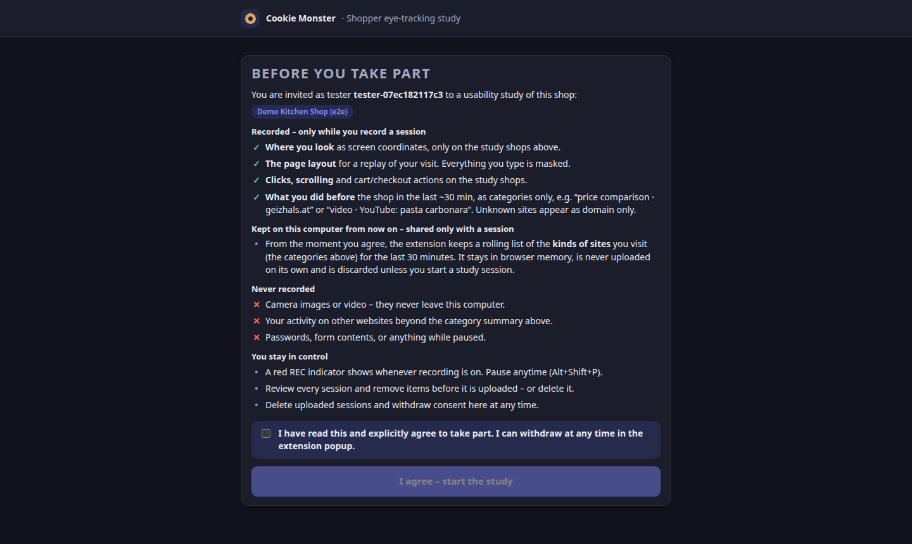
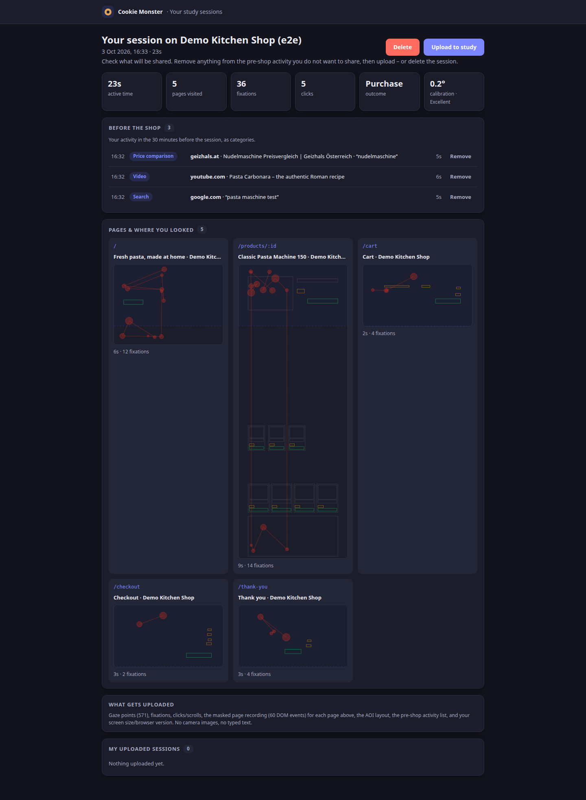

# 🍪 Cookie Monster: see your shop through your shoppers' eyes

**Opt-in eye-tracking usability research for online shops, using only a normal laptop.**

Testers shop as they normally would. A browser extension and the laptop's webcam and IR camera record **where they look**, **what they do**, and **what led them to the shop**: a YouTube recipe, a price comparison, a Google search. The shop owner gets session replays with the gaze path, heatmaps, attention metrics per product, detected UX problems, and an **AI-written report** with prioritized fixes. Every recommendation links to the replay moment that supports it.



---

## The problem

Shop analytics tell owners **what** happened (bounce, cart abandonment) but not **why**. Did the shopper look at the price and leave? Never see the reviews? Arrive from a cooking video and fail to find the pasta machine they had just watched someone use? Eye-tracking studies answer these questions, but they need lab hardware, a moderator, and weeks of work.

## What Cookie Monster does

| | |
|---|---|
| 👁️ **Webcam eye tracking** | A local helper tracks gaze at 30 Hz with MediaPipe iris landmarks, head pose and (with the emitter on) IR pupil refinement. There's a 9-point calibration, a 5-point accuracy check, and a *browser-window check* that corrects the window offset browsers don't report (e.g. on Wayland). |
| 🧭 **Journey before the shop** | The extension categorizes what the tester did beforehand, such as *price comparison · geizhals.at*, *video · "How to Make Fresh Pasta Like an Italian Nonna"* or *search · "pasta maschine test"*. Only categories are kept, never full browsing history. |
| 🎬 **Session replay** | A DOM replay (rrweb, with all inputs masked) and a synchronized gaze path: numbered fixations, a live gaze dot, and click and funnel markers. **Play all** runs through the whole session page by page. |
| 🔥 **Heatmaps and product attention** | Fixations are mapped to *areas of interest* (product cards, images, prices, reviews, buttons) from schema.org data, owner-defined selectors and heuristics. The products page compares dwell time, time to first fixation, clicks, add-to-cart and purchases. |
| 🚨 **UX issue detection** | Rage clicks, dead clicks, long visual search, hesitating at the main button (the "call to action"), viewed but not clicked, price or reviews never seen, content below the fold never seen, cart abandonment. |
| 🤖 **AI feedback** | OpenAI turns a compact digest of the sessions (no raw gaze) into a plain-language report for owners: what works, product insights and UX findings, each with **evidence links into the replay**. |
| 🔒 **Privacy by design** | Explicit consent on install, a visible REC indicator, pause, review before upload, and delete. Camera images never leave the laptop, and gaze is recorded only on the study shop. |

<table>
<tr>
<td><br><sub><b>AI shop report:</b> prioritized findings with replay evidence</sub></td>
<td><br><sub><b>Page heatmap</b> over the real recorded page, with labelled product areas</sub></td>
</tr>
<tr>
<td><br><sub><b>Overview:</b> funnel, pre-shop context vs. conversion, top paths and issues</sub></td>
<td><br><sub><b>Products:</b> attention vs. clicks vs. add-to-cart, attention split</sub></td>
</tr>
<tr>
<td><br><sub><b>Tester side:</b> agree once on install, then you're done</sub></td>
<td><br><sub><b>Review before upload:</b> remove anything you don't want to share</sub></td>
</tr>
</table>

## How it works

```
 ThinkPad webcam + IR camera
        │  frames never leave this process
        ▼
 gaze-helper (Python) ── MediaPipe face/iris → features → ridge regression → One-Euro filter → 30 Hz gaze
        │  Chrome native messaging (stdin/stdout)
        ▼
 Chrome extension (MV3) ── screen → page coordinates (+ window correction) → fixations (I-DT) → product areas
        │                   rrweb DOM recording · clicks/scroll/cart events · categorized pre-shop context
        │  upload after the tester reviews it
        ▼
 server (Fastify + SQLite) ── allowlist enforcement · analytics · UX issue rules · heatmaps · journeys
        │                      AI digest ──► OpenAI (structured output) ──► report with evidence
        ▼
 dashboard (React) ── replay + gaze path · Play all · heatmaps · products · UX issues · AI report
```

| Package | What's inside |
|---|---|
| [`gaze-helper/`](gaze-helper/README.md) | Python 3.12 (uv). Camera capture (RGB 1280×720 MJPEG + IR 640×360 GREY), features, calibration, filtering, native host, a **mock mode** for testing without a camera, and a camera self-test |
| [`extension/`](extension/README.md) | Chrome MV3 in TypeScript, built with esbuild. Welcome and consent page, calibration UI, context classifier, recorder, debug overlay, review page |
| [`server/`](server/README.md) | Fastify, better-sqlite3 and zod. Ingest, analytics, AI report, synthetic seed data |
| [`dashboard/`](dashboard/README.md) | React 19, Vite, Tailwind and rrweb replay |
| [`demo-shop/`](demo-shop/README.md) | "Demo Kitchen Shop" with deliberate UX flaws, for demos and tests |
| `packages/shared/` | Shared contracts (zod): session format, native protocol, API types |
| `e2e/` | End-to-end test of the whole system in headless Chrome |

## Run the demo

Requires Node ≥ 20.17, [uv](https://docs.astral.sh/uv/), and Google Chrome (snap Chromium cannot start the helper).

```bash
npm install
(cd gaze-helper && uv sync && ./download_model.sh)   # Python deps + MediaPipe face model

cp server/.env.example server/.env                   # add OPENAI_API_KEY for AI reports
npm run seed -w server -- --synthetic 6              # demo shop + tester + 6 synthetic sessions

npm run dev:server      # API          http://localhost:8787
npm run dev:dashboard   # owner UI     http://localhost:5173   (owner token: dev-owner)
npm run dev:shop        # demo shop    http://localhost:5174
```

**Record a real session (tester side):**
1. `npm run build:extension`, then in `chrome://extensions` turn on *Developer mode* → *Load unpacked* → choose `extension/dist`.
2. `gaze-helper/install_host.sh` registers the gaze helper with Chrome (`--mock` uses fake gaze instead of the camera).
3. The **welcome page opens by itself**: tick the box and click *I agree*. The study server and invite code come from `extension/study.config.json`.
4. **Calibrate** (about 45 s): follow the dots at about an arm's length (50–60 cm) from the screen.
5. Browse as usual (YouTube, a price comparison, a search), then open the demo shop and click **Start** on the banner.
6. Shop, press **Stop**, review what will be shared, then **Upload**. The session appears in the dashboard.

**Demo script (3 minutes):** Overview (funnel and pre-shop context vs. conversion) → a session: the journey timeline, then **Play all** with the full gaze path → Page heatmaps on `/products/:id` → Products (viewed but not clicked) → **AI report**: click an evidence time to jump into the replay.

### IR camera (optional, more accurate)
The T14's IR emitter is off by default on Linux. Install [linux-enable-ir-emitter](https://github.com/EmixamPP/linux-enable-ir-emitter), run its configure step with sudo for `/dev/video2`, and check with `cd gaze-helper && uv run python -m gaze_helper selftest --seconds 8`; it should report `IR lit`. Without the emitter, tracking uses the webcam only.

## Tests

```bash
npm test                              # shared, extension, server, dashboard: 120 unit/API tests
(cd gaze-helper && uv run pytest)     # helper: protocol framing, calibration, features, filter (18)
npm run e2e                           # whole system in headless Chrome (34 checks)
```

`npm run e2e` starts a throwaway server, demo shop and dashboard and builds an extension with the test invite built in. It loads that extension into headless Chrome; gaze comes from the **real gaze helper in mock mode** over native messaging. Then it walks through the whole flow:
1. Install → the welcome page opens → agree.
2. Calibration, accuracy check and browser-window check.
3. Pre-shop browsing on locally faked Geizhals, YouTube and Google pages, including YouTube's in-page navigation waking the stopped extension.
4. Shopping, checkout and upload.
5. Server-side checks: journey categories, fixations mapped to product areas, funnel events, typed form data masked everywhere, product metrics, heatmap, background tabs not recorded.
6. Dashboard screenshots, then deletion by the tester.

It never touches your Chrome profile or `server/data`.

## Privacy model

- **Consent on install.** The welcome page explains exactly what is recorded; nothing happens before you agree. You can withdraw consent in the popup at any time.
- **Camera images stay on the laptop.** The helper only sends gaze coordinates.
- **Recording is limited to the study shop.** Gaze, DOM, clicks and scrolling are recorded only on allowlisted shop hosts, only while a session runs and isn't paused. The extension enforces this, and the server rejects anything else.
- **Pre-shop activity is categories only.** It's kept in a 30-minute buffer in browser memory and discarded unless a session starts. Titles are kept only where they matter (videos, recipes, price comparison, review sites). The tester can remove entries before upload.
- **Testers stay in control.** Form inputs are masked in the DOM recording. Testers review before upload and can delete sessions locally and on the server.
- **Mouse debug sessions are labelled.** Sessions recorded with mouse-as-gaze are marked "mouse · debug", and the AI is told not to treat them as eye tracking.

## Limitations and what's next

- **Accuracy:** webcam only gives roughly 2–4°; the target of ≤ 2° needs the IR emitter. Sitting too close (< 45 cm) hurts. Next: implicit recalibration from clicks (people look at what they click), and storing raw gaze so recordings can be reprocessed later.
- **Platform:** built and tested on a ThinkPad T14 (Linux, Wayland) with Google Chrome. The helper is Linux-first (V4L2).
- **Pre-shop context** uses domain rules plus page titles; an on-device model could classify more sites.
- **Scale:** dashboard aggregates are recalculated on every request, which is fine for study-sized data. Next: caching, multi-shop accounts, recruiting and paying testers.

## License

[MIT](LICENSE)
